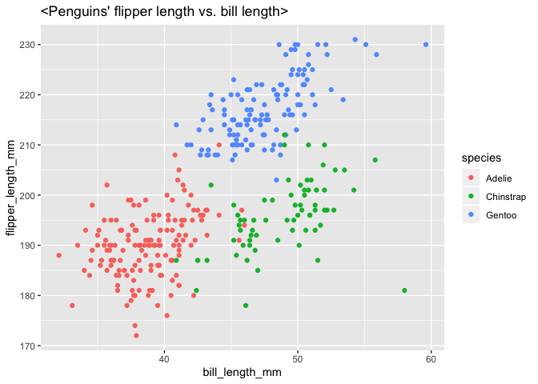

p8105\_hw1\_sp3804
================
Shannon (Seonyoung Park) (sp3804)
9/15/2020

This is my solution to HW1

## Problem 1

### Creat a data frame with the specified elements.

``` r
prob1_df = 
  tibble(
  samp = rnorm(10),
  samp_gt_0 = samp > 0,
  char_vec = c("a","b","c","d","e","f","g","h","i","j"),
  factor_vec = factor(c("low","low","low","mod","mod","mod","high","high","high","high"))
)
```

### Take the mean of each variable in my data frame.

\-result: I can take the mean of number but not character nor
    factor.

``` r
mean(pull(prob1_df, samp))
```

    ## [1] -0.7554607

``` r
mean(pull(prob1_df, samp_gt_0)) #mean = 0.6 (?)
```

    ## [1] 0.2

``` r
mean(pull(prob1_df, char_vec)) #not possible (x numeric)
```

    ## Warning in mean.default(pull(prob1_df, char_vec)): argument is not numeric or
    ## logical: returning NA

    ## [1] NA

``` r
mean(pull(prob1_df, factor_vec)) #not possible (x numeric)
```

    ## Warning in mean.default(pull(prob1_df, factor_vec)): argument is not numeric or
    ## logical: returning NA

    ## [1] NA

### Let’s use as.numeric function

  - result: not possible for character nor factor
  - Does this help explain what happens when you try to take the mean?:
    Yes. Since character and factor cannot be changed as numeric value,
    we cannot calculate the mean of
    them.

<!-- end list -->

``` r
as.numeric(pull(prob1_df, samp))
```

    ##  [1] -0.89101035 -1.90877498 -0.49079203 -0.74709600 -0.03207255  0.24389146
    ##  [7] -1.84502379 -1.49531739 -1.07667693  0.68826564

``` r
as.numeric(pull(prob1_df, samp_gt_0)) 
```

    ##  [1] 0 0 0 0 0 1 0 0 0 1

``` r
as.numeric(pull(prob1_df, char_vec)) 
```

    ## Warning: NAs introduced by coercion

    ##  [1] NA NA NA NA NA NA NA NA NA NA

``` r
as.numeric(pull(prob1_df, factor_vec)) 
```

    ##  [1] 2 2 2 3 3 3 1 1 1 1

``` r
#1
as.numeric(pull(prob1_df, samp_gt_0))*pull(prob1_df,samp) 
```

    ##  [1] 0.0000000 0.0000000 0.0000000 0.0000000 0.0000000 0.2438915 0.0000000
    ##  [8] 0.0000000 0.0000000 0.6882656

``` r
#2
as.factor(pull(prob1_df, samp_gt_0))*pull(prob1_df,samp)
```

    ## Warning in Ops.factor(as.factor(pull(prob1_df, samp_gt_0)), pull(prob1_df, : '*'
    ## not meaningful for factors

    ##  [1] NA NA NA NA NA NA NA NA NA NA

``` r
#3
as.numeric(as.factor(pull(prob1_df, samp_gt_0)))*pull(prob1_df,samp)
```

    ##  [1] -0.89101035 -1.90877498 -0.49079203 -0.74709600 -0.03207255  0.48778291
    ##  [7] -1.84502379 -1.49531739 -1.07667693  1.37653128

## Problem 2

``` r
library(palmerpenguins)
data("penguins", package = "palmerpenguins")
penguins
```

    ## # A tibble: 344 x 8
    ##    species island bill_length_mm bill_depth_mm flipper_length_… body_mass_g
    ##    <fct>   <fct>           <dbl>         <dbl>            <int>       <int>
    ##  1 Adelie  Torge…           39.1          18.7              181        3750
    ##  2 Adelie  Torge…           39.5          17.4              186        3800
    ##  3 Adelie  Torge…           40.3          18                195        3250
    ##  4 Adelie  Torge…           NA            NA                 NA          NA
    ##  5 Adelie  Torge…           36.7          19.3              193        3450
    ##  6 Adelie  Torge…           39.3          20.6              190        3650
    ##  7 Adelie  Torge…           38.9          17.8              181        3625
    ##  8 Adelie  Torge…           39.2          19.6              195        4675
    ##  9 Adelie  Torge…           34.1          18.1              193        3475
    ## 10 Adelie  Torge…           42            20.2              190        4250
    ## # … with 334 more rows, and 2 more variables: sex <fct>, year <int>

``` r
nrow(penguins) #344 row
```

    ## [1] 344

``` r
ncol(penguins) #8 column
```

    ## [1] 8

``` r
#another way; glimpse
glimpse(penguins)
```

    ## Rows: 344
    ## Columns: 8
    ## $ species           <fct> Adelie, Adelie, Adelie, Adelie, Adelie, Adelie, Ade…
    ## $ island            <fct> Torgersen, Torgersen, Torgersen, Torgersen, Torgers…
    ## $ bill_length_mm    <dbl> 39.1, 39.5, 40.3, NA, 36.7, 39.3, 38.9, 39.2, 34.1,…
    ## $ bill_depth_mm     <dbl> 18.7, 17.4, 18.0, NA, 19.3, 20.6, 17.8, 19.6, 18.1,…
    ## $ flipper_length_mm <int> 181, 186, 195, NA, 193, 190, 181, 195, 193, 190, 18…
    ## $ body_mass_g       <int> 3750, 3800, 3250, NA, 3450, 3650, 3625, 4675, 3475,…
    ## $ sex               <fct> male, female, female, NA, female, male, female, mal…
    ## $ year              <int> 2007, 2007, 2007, 2007, 2007, 2007, 2007, 2007, 200…

``` r
#mean of flipper_length_mm; except for NA, mean of flipper_length_mm is 200.9 (mm)
mean(pull(penguins, flipper_length_mm), na.rm=TRUE) 
```

    ## [1] 200.9152

``` r
#scatterplot

ggplot(penguins, aes(x=bill_length_mm, y=flipper_length_mm, color=species))+geom_point()+ggtitle("<Penguins' flipper length vs. bill length>")
```

    ## Warning: Removed 2 rows containing missing values (geom_point).

<!-- -->

``` r
ggsave("flipper vs.bill_plot.pdf", height =4, width=6)
```

    ## Warning: Removed 2 rows containing missing values (geom_point).
